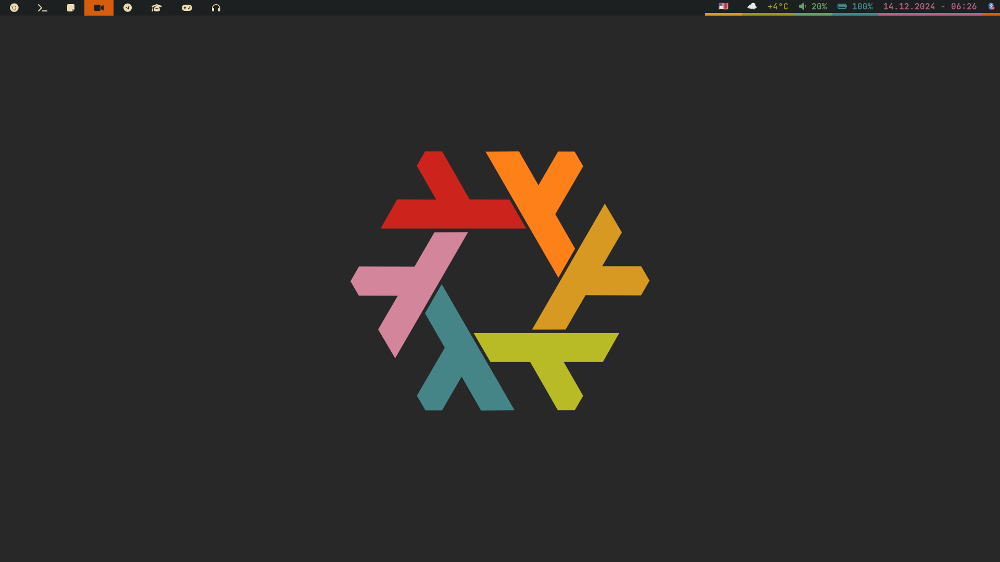

# ❄️ NixOS Config

This is my personal NixOS configuration.



## ✨ Features

- 🖥️ **Multiple Hosts Support**: Easy to configure for different hosts.
- 🎨 **Gruvbox Theme**: A perfect blend of vibrant and subtle colors.
- 🪟 **Hyprland + Waybar**: 10/10 window compositor on Wayland.
- 🏠 **Home Manager Integration**: lots of stuff configured.
- 🧇 **Tmux**: with my own hotkeys.
- 🌟 **Bash + starship**: Efficient shell setup with lots of aliases.

## 🚀 Installation

To get started with this setup, follow these steps:

1. **NixOS**: boot into the NixOS ISO image.
2. **Clone the Repository**:

    ```bash
    git clone https://github.com/alemoreno991/nix-project
    cd nix-project
    ```

3. **Format & Partition the Disk**:

    ```bash
    sudo nix --experimental-features "nix-command flakes" run github:nix-community/disko/latest -- --mode destroy,format,mount hosts/thermopylae/disko.nix
    ```

4. **Install your customized NixOS**:

    ```bash
    sudo nixos-rebuild switch --flake .#thermopylae
    ```

> [!Tip]
> In case you want to rebuild your NixOS configuration, make sure to first
> `git add .` your changes and then `sudo nixos-rebuild switch --flake .#thermopylae`

## Directory Structure

```shell
.
├── flake.lock              # Pin the versions of the packages used by NixOS
├── flake.nix               # Entrypoint of the flake-based NixOS config
├── home-manager        #--- Configurations related to specific USERS
│   ├── home.nix            # Entrypoint for the user-specific configuration
│   ├── home-packages.nix   # Defines the user-specific packages
│   └── modules             #--- Collection of packages with custom settings (shared by many USERS)
├── hosts               #--- Configurations related to specific HOSTS
│   └── thermopylae         #--- `configuration.nix`, `hardware-configuration.nix`
├── nixos               #--- Configurations shared by many HOSTS
│   └── modules             #--- Collection of packages with custom settings (shared by many HOSTS)
└── secrets.yaml            # File that stores the secrets injected into the configurations.
```

## 😎 Enjoy!


## 🤝 Contributions
